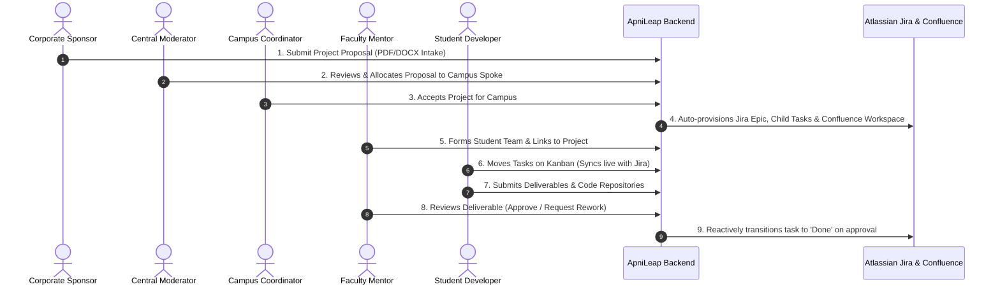

# ApniLeap OS

<div align="center">


### Enterprise Academic-Corporate Project Orchestration Platform

[](https://reactjs.org/)
[](https://vitejs.dev/)
[](https://nodejs.org/)
[](https://expressjs.com/)
[](https://www.postgresql.org/)
[](https://www.prisma.io/)
[](https://www.atlassian.com/software/jira)
[](https://www.atlassian.com/software/confluence)

**ApniLeap OS** is an end-to-end, multi-tenant academic-corporate platform designed to orchestrate industry capstones, sponsored student research, and distributed campus deployments across universities with native Atlassian Jira & Confluence synchronization.

</div>

---

## 📌 Table of Contents
- [Platform Overview](#-platform-overview)
- [End-to-End Workflow](#-end-to-end-workflow)
- [User Roles & Personas](#-user-roles--personas)
- [Core Features](#-core-features)
- [Atlassian Jira & Confluence Integration](#-atlassian-jira--confluence-integration)
- [Security & Zero-Data-Leakage Architecture](#-security--zero-data-leakage-architecture)
- [Multi-Tenant Production Roadmap](#-multi-tenant-production-roadmap)
- [System Architecture](#-system-architecture)
- [Project Structure](#-project-structure)
- [Getting Started](#-getting-started)
  - [Prerequisites](#prerequisites)
  - [Backend Setup](#1-backend-setup)
  - [Frontend Setup](#2-frontend-setup)
  - [Environment Configuration](#3-environment-configuration)
- [Testing Accounts](#-testing-accounts)
- [License](#-license)

---

## 🌐 Platform Overview

Bridging the gap between corporate R&D sponsors and engineering institutions frequently encounters friction: manual proposal approvals, fragmented tracking tools, and delayed feedback cycles.

**ApniLeap OS** unifies this ecosystem through an enterprise **Hub-and-Spoke** architecture:
* **The Central Hub:** Corporate Sponsors (NVIDIA, Intel, Google) and Executive Moderators govern proposals, budget allocations, and institutional performance.
* **Campus Spokes:** Partner universities (e.g., KLE Technological University, COEP, MMCOEP, RIT) accept proposals, manage student talent pools, and schedule review syncs.
* **Execution Units:** Faculty Mentors pair with student cohorts, reviewing deliverables and monitoring progress directly synchronized with Atlassian Jira Agile boards and Confluence knowledge bases.

---

## 🔄 End-to-End Workflow



### The Lifecycle Stages:
1. **Intake & Proposal Parsing:** The **Corporate Sponsor** submits project proposals. The automated document parser extracts title, budget, duration, technical scope, and milestone phases from `.pdf` and `.docx` files.
2. **Campus Allocation:** The **Central Moderator** reviews pending proposals and routes them to eligible campus spokes.
3. **Acceptance & Automated Provisioning:** The **Campus Coordinator** accepts the project. ApniLeap calls the Atlassian REST APIs to:
   - Create a Jira Epic with milestone tasks.
   - Provision a dedicated **Confluence Project Workspace** linked to the Jira Epic.
4. **Team Formation & Mentor Pairing:** The **Faculty Mentor** creates student teams and assigns them to the active project.
5. **Kanban Sprint Execution:** **Student Developers** work through their backlog. Dragging cards across columns (*Backlog* → *In Progress* → *Done*) triggers live bidirectional transitions in Jira.
6. **Reactive Review & Closure:** Students submit deliverables. When approved by the mentor, the system reactively marks the Jira issue as **Done** and updates project velocity metrics.

---

## 👥 User Roles & Personas

| Role | Default Login | Permissions & Capabilities |
| :--- | :--- | :--- |
| **Executive Administrator** | `admin@apnileap.com` | Global governance, spoke creation, institutional KPI oversight, cross-campus management. |
| **Corporate Partner** | `sponsor@company1.com` | Submits B2B project proposals, reviews deliverables, tracks cross-campus ROI and milestone completion. |
| **Campus Coordinator** | `kle@apnileap.com` | Reviews incoming project proposals for the campus, oversees mentor workloads, manages calendar syncs. |
| **Faculty Mentor** | `mentor@kle.edu` | Forms teams, schedules team/project syncs, evaluates deliverables, triggers rework requests. |
| **Student Developer** | `manasa@kle.edu` | Accesses assigned Kanban board, updates task progress, uploads milestone submissions, participates in team chat. |

---

## ✨ Core Features

### 📑 Automated Document Parsing (PDF / DOCX)
* Automated ingestion of proposal documents using `pdf-parse` and `mammoth`.
* Regex-driven extraction of project metadata: budget, duration, technical stack, problem statements, and milestone timelines.

### 📋 Bidirectional Atlassian Jira Kanban Synchronization
* Native bidirectional integration with Jira Agile REST APIs (`/rest/agile/1.0/board`).
* Drag-and-drop Kanban board powered by `react-beautiful-dnd`.
* Dragging cards fires live transition queries (`/rest/api/3/issue/{key}/transitions`).
* Resilient offline circuit breaker: falls back to local database persistence if Jira is temporarily unreachable.

### 📚 Automated Confluence Project Workspaces
* Auto-creates a dedicated Confluence documentation page upon project acceptance.
* Automatically embeds project scope, company sponsor details, deliverables outline, and direct links to the Jira Epic.

### 📅 Dual-Scope Meeting Scheduler
* Schedule cadence meetings with two distinct targeting scopes:
  - **By Team:** Automatically populates all members of an assigned student cohort.
  - **By Project:** Dynamically discovers all teams linked to a project and populates attendees.
* Pre-fills Google Meet links, agendas, and sends automated calendar notifications.

### 📤 Reactive Deliverable Submission & Review Loop
* Students submit code repositories and milestone reports.
* Mentors approve or request rework with targeted feedback.
* Approvals automatically trigger task completion on the Jira Kanban board.

---

## 🔒 Security & Zero-Data-Leakage Architecture

To protect student intellectual property and prevent cross-institutional data exposure, ApniLeap enforces multi-tiered security:

1. **Gated Student Onboarding:**
   - Registration requires email OTP verification.
   - Accounts are created with `PENDING` status until reviewed and approved by the campus Faculty Mentor.
2. **Atlassian Domain Gatekeeping ("Require Admin Approval"):**
   - Atlassian Cloud access settings are configured to **Require Admin Approval**.
   - Students cannot consume Jira license seats without explicit administrator sign-off.
3. **Isolated Jira Permission Schemes ("Browse Projects" Restriction):**
   - Standard Jira instances allow any logged-in user to view all organizational projects.
   - ApniLeap implements a custom **Permission Scheme** restricting `Browse Projects` to:
     - Master Site Administrators (`jira-admins-apnileapp`)
     - Assigned Project Administrators / Mentors
     - Explicitly added Team Members
   - Students only see their own team's sprint board and backlog; cross-college projects remain completely hidden.

---

## 🚀 Multi-Tenant Production Roadmap

* **Prototype Stage (Current):** Centralized master instance (`apnileapp.atlassian.net`) utilizing project-level permission schemes and custom board filters for demo execution.
* **Production Architecture (Future Scope):**
  - **Dedicated Atlassian Site per Spoke:** `apnileap-kle.atlassian.net`, `apnileap-coep.atlassian.net`, etc.
  - **Strict Multi-Tenancy:** 100% data residency and GDPR compliance per institution.
  - **Centralized Hub Federation:** ApniLeap Hub backend federates across multiple Jira Cloud sites using Atlassian Organization APIs.

---

## 🛠️ System Architecture

```
┌────────────────────────────────────────────────────────┐
│               Frontend (React 18 + Vite)               │
│  Tailwind / Custom CSS  •  Recharts  •  React-Dnd UI   │
└───────────────────────────┬────────────────────────────┘
                            │ HTTP / REST API
┌───────────────────────────▼────────────────────────────┐
│              Backend (Node.js + Express)               │
│   Auth Middleware  •  Upload Handlers  •  Jira Router  │
└─────────────┬────────────────────────────┬─────────────┘
              │                            │
   Prisma ORM │                            │ Atlassian REST APIs
┌─────────────▼──────────────┐  ┌──────────▼──────────────────────────┐
│    PostgreSQL Database     │  │        Atlassian Cloud Suite        │
│  Users, Projects, Teams,   │  │  Jira Agile Boards & Issues         │
│  Meetings, Submissions     │  │  Confluence Workspaces & Pages      │
└────────────────────────────┘  └─────────────────────────────────────┘
```

---

## 📂 Project Structure

```bash
apnileap/
├── backend/
│   ├── middleware/        # JWT Authentication and security middleware
│   ├── models/            # Schema adapters & data models
│   ├── prisma/
│   │   └── schema.prisma  # PostgreSQL Prisma schema definitions
│   ├── routes/            # Express route controllers (auth, docs, notifications)
│   ├── uploads/           # Uploaded deliverables and proposal files
│   ├── utils/             # Mailer, Confluence, and Jira utility services
│   ├── seed.js            # Comprehensive database seeder with mock personas
│   └── server.js          # Main Express server and Jira integration layer
│
├── frontend/
│   ├── public/            # Static assets and icons
│   ├── src/
│   │   ├── assets/        # Media assets, banners, and logos
│   │   ├── components/    # Modular React views (Kanban, Calendar, TeamChat, etc.)
│   │   ├── App.jsx        # Root application and dashboard router
│   │   ├── index.css      # Design system & typography
│   │   └── main.jsx       # React application entry point
│   ├── index.html         # HTML entry
│   └── vite.config.js     # Vite configuration
│
├── .gitignore             # Git ignore definitions
└── README.md              # Project documentation
```

---

## 🚀 Getting Started

### Prerequisites
* **Node.js**: v18.0.0 or higher
* **PostgreSQL**: v14 or higher (Local or Neon / Supabase / AWS RDS)
* **Atlassian Account**: Jira Cloud & Confluence (Optional for mock mode; required for live sync)

---

### 1. Backend Setup

```bash
cd backend

# Install dependencies
npm install

# Configure environment
cp .env.example .env

# Generate Prisma client and push schema
npx prisma generate
npx prisma db push

# (Optional) Seed mock data
node seed.js

# Start backend server
npm run dev
# Server runs on http://localhost:5001
```

---

### 2. Frontend Setup

```bash
cd frontend

# Install dependencies
npm install

# Launch Vite development server
npm run dev
# Vite runs on http://localhost:5173
```

---

### 3. Environment Configuration

Create a `.env` file in the `backend/` directory:

```env
# Database Configuration (PostgreSQL)
DATABASE_URL="postgresql://<USER>:<PASSWORD>@localhost:5432/apnileappp?schema=public"

# Atlassian Jira & Confluence Cloud Integration
JIRA_DOMAIN="https://<YOUR_WORKSPACE>.atlassian.net"
JIRA_EMAIL="your-atlassian-email@example.com"
JIRA_API_TOKEN="your_atlassian_api_token"

# JWT Secret
JWT_SECRET="your_jwt_secret_key"

# Email SMTP Notification Service
SMTP_HOST="smtp.gmail.com"
SMTP_PORT="465"
SMTP_SECURE="true"
SMTP_USER="your-email@gmail.com"
SMTP_PASS="your-app-password"
SMTP_FROM_NAME="ApniLeap Hub"
```

> **Tip:** Generate an Atlassian API token at [Atlassian API Tokens](https://id.atlassian.com/manage-profile/security/api-tokens).

---

## 🔑 Testing Accounts

| Persona | Email | Password | Campus / Spoke |
| :--- | :--- | :--- | :--- |
| **Central Admin** | `admin@apnileap.com` | `admin123` | Central Hub |
| **Corporate Sponsor** | `sponsor@company1.com` | `spoke123` | Corporate Partner |
| **KLE Coordinator** | `kle@apnileap.com` | `spoke123` | KLE Tech (Spoke 3) |
| **COEP Coordinator** | `coep@apnileap.com` | `spoke123` | COEP (Spoke 101) |
| **MMCOEP Coordinator** | `mmcoep@apnileap.com` | `spoke123` | MMCOEP (Spoke 102) |
| **RIT Coordinator** | `rit@apnileap.com` | `spoke123` | RIT (Spoke 103) |
| **Faculty Mentor** | `mentor@kle.edu` | `faculty123` | KLE Tech (Spoke 3) |
| **Student Developer** | `manasa@kle.edu` | `student123` | KLE Tech (Spoke 3) |

---

## 📄 License

This project is licensed under the MIT License — see the [LICENSE](LICENSE) file for details.

<div align="center">
Built with ❤️ to empower university-industry collaboration.
</div>
